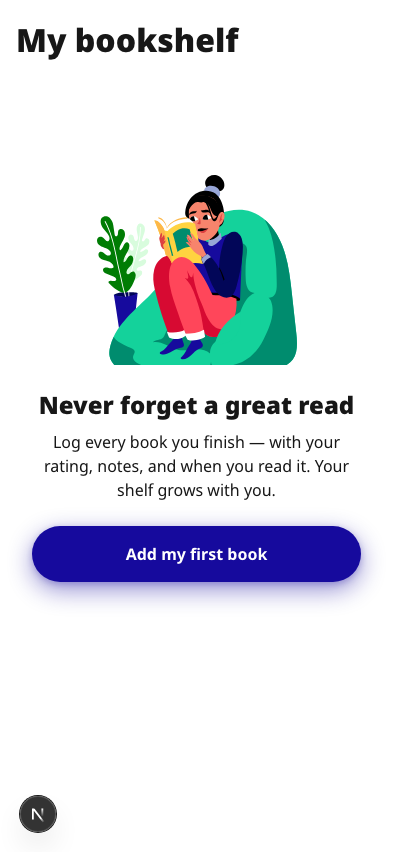
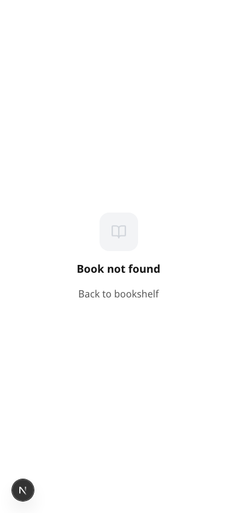
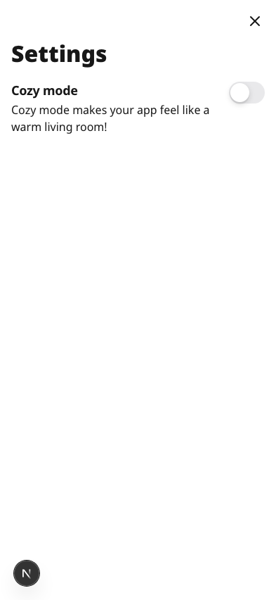
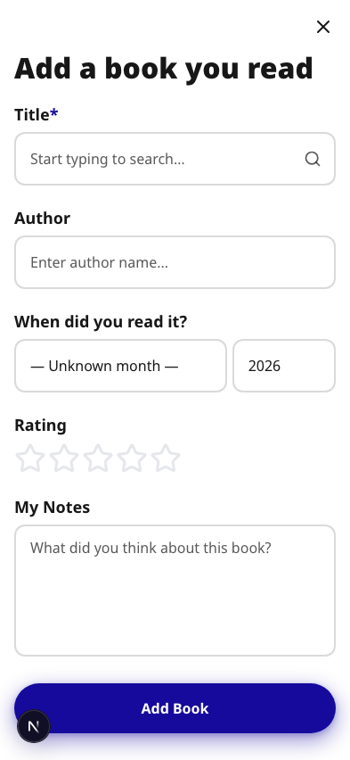

# 📚 My Bookshelf

A personal bookshelf app to track books you've read — with cover art, ratings, notes, and a cozy reading mode.



---

## Features

### 📖 Track your reading
Add books you've read with title, author, rating (1–5 stars), month/year, and personal notes. Books are grouped by year on the shelf.

### 🔍 Smart book search
Start typing a title and get live suggestions pulled from **Open Library** and **Google Books** — complete with cover art auto-filled.

### 🖼️ Grid & List view
Switch between a visual grid of cover art and a compact list layout. Your preference is saved automatically.


### 📄 Rich book detail page
Each book has a dedicated detail view showing:
- Your personal notes
- **Released** date and **Genre** (auto-fetched from Google Books)
- **About the book** — back-cover synopsis pulled from public APIs




### 🔥 Cozy mode
Enable Cozy mode in Settings to transform the app into a warm reading nook — animated fireplace, amber background, and orange accent color throughout.


### ⚙️ Settings
Toggle Cozy mode on/off from the Settings page.



---

## Tech stack

| Layer | Choice |
|---|---|
| Framework | [Next.js 15](https://nextjs.org) (App Router) |
| Language | TypeScript |
| Styling | Tailwind CSS |
| Animations | Framer Motion |
| Storage | `localStorage` (no backend required) |
| Book data | [Open Library API](https://openlibrary.org/developers/api) + [Google Books API](https://developers.google.com/books) |

---

## Getting started

```bash
npm install
npm run dev
```

Open [http://localhost:3000](http://localhost:3000) in your browser.

---

## Adding a book

1. Tap **+** on the home screen
2. Start typing the title — suggestions appear automatically
3. Select a suggestion or fill in the fields manually
4. Set your rating, when you read it, and any notes
5. Tap **Add book**


